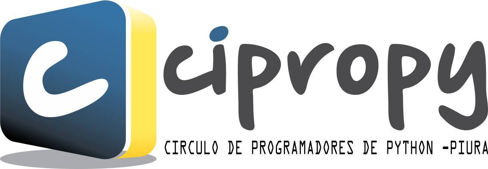

.. title: Bienvenidos
.. slug: index
.. date: 2016-07-20 00:28:05 UTC
.. tags: 
.. category: 
.. link: 
.. description: 
.. type: text
.. template: notitle.tmpl

¿Quienes Somos?
---------------

.. class:: lead

Somos una comunidad creada con el objetivo de agrupar a todos los interesados en el lenguaje de programación Python, nuestro centro de operaciones está ubicado en la cálida ciudad de Piura, al norte del Perú. Queremos conocer gente interesada en aprender, compartir ideas, crear proyectos y pasar un rato agradable. Queremos generar un espacio donde cualquier persona interesada en aprender sobre Python encuentre las herramientas necesarias para hacerlo.